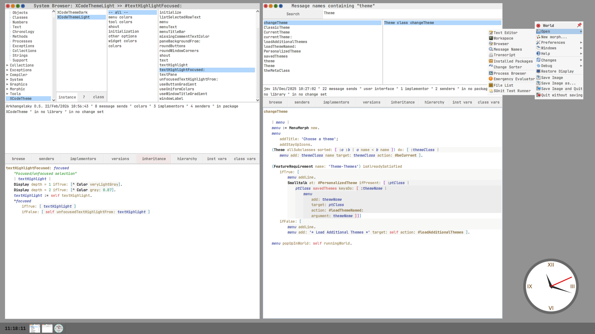
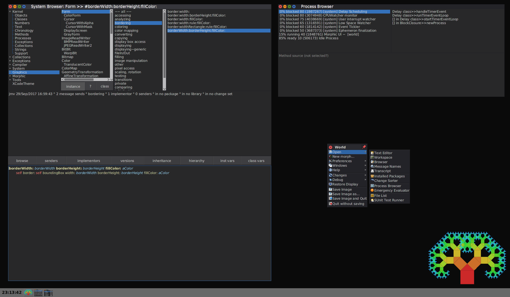

# Cuis-Smalltalk-XCodeTheme

Themes inspired by Apple's Xcode IDE for Cuis Smalltalk




## Themes
- XCodeThemeLight
- XCodeThemeDark

## Installation
- Drag and drop `XCodeTheme.pck.st` file into Cuis
- Do it for light theme
```smalltalk 
XCodeThemeLight beCurrent.
```
- Do it for dark theme
```smalltalk 
XCodeThemeDark beCurrent.
```

Tested on `Cuis7.7 update 7839`.